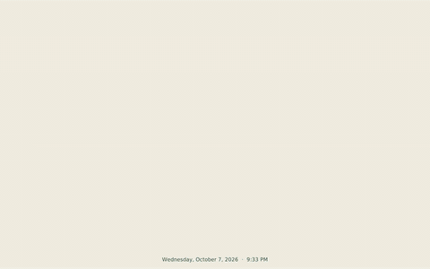

# Ambient Photos

A fullscreen photo display for Ubuntu GNOME. It starts after you have been idle, scrolls through your photos, and closes when you return.

<p align="center">
  
</p>

## Quick start

**Prebuilt archive.** Download `ambient-screensaver-v0.1.0-ubuntu-24.04-x86_64.tar.gz` from a release's Assets, or use the locally built copy in `dist/`. From the directory containing the archive, run:

```sh
tar -xzf ambient-screensaver-v0.1.0-ubuntu-24.04-x86_64.tar.gz
cd ambient-screensaver-v0.1.0-ubuntu-24.04-x86_64
./ambient-screensaver gnome install --idle-seconds 120 "$HOME/Pictures"
```

No Rust installation is needed to use the archive. To build from source instead, install Rust and run these commands from the repository:

```sh
cargo build --release
./target/release/ambient-screensaver gnome install --idle-seconds 120 "$HOME/Pictures"
```

Replace `"$HOME/Pictures"` with a folder containing photos. Add more folders at the end of the command if needed. The app copies itself into your user account and starts at your next GNOME login. You can delete the extracted archive folder after installation. Keep your photo folders at the same paths.

Set the idle time below GNOME's screen blank or lock timeout. This app does not replace the lock screen.

## Change settings, update, or remove

Check your saved idle time and photo folders:

```sh
~/.local/share/ambient-screensaver/bin/ambient-screensaver gnome status
```

Change the timeout or folders by running `gnome install` again from the installed copy. This example waits five minutes and uses two folders:

```sh
~/.local/share/ambient-screensaver/bin/ambient-screensaver gnome install --idle-seconds 300 "$HOME/Pictures" "$HOME/Family Photos"
```

Include **every folder you want to keep** and the desired timeout each time. Omit `--idle-seconds` to use the 120-second default. To update the app itself, run the same install command from a newer downloaded or rebuilt binary. You do not need to uninstall first. Changes take effect at your next GNOME login if the idle watcher is already running.

Remove the installed app, saved settings, and login entry with:

```sh
~/.local/share/ambient-screensaver/bin/ambient-screensaver gnome uninstall
```

An idle watcher already running will stop when you log out. To test an installation before the next login, run the installed binary with `gnome run` in a terminal; press Ctrl+C to stop it. Only one watcher can run at a time.

## Run directly

To preview without waiting for idle:

```sh
~/.local/share/ambient-screensaver/bin/ambient-screensaver --windowed "$HOME/Pictures"
```

While developing, run from the repository so Cargo builds your current changes before launching:

```sh
cargo run -- --windowed photos
```

The local `photos/` folder is gitignored test data; replace it with any photo folder. Development builds use faster photo downscaling so previews start sooner. Use `cargo run --release -- --windowed photos` to test the higher-quality release scaling. The executable under `~/.local/share/ambient-screensaver/bin/` is a separate installed copy and does not update when you edit or build the source.

The default is a continuous rightward scroll at 1.25 screen widths per minute. Use `--scroll-speed 1` to slow it to one screen width per minute, `--background-color '#DCE8E0'` to change the cream mat, or `--style slides --duration 8 --transition 1.5` for the earlier slide layout. These display options currently work only for direct launches; GNOME setup saves photo folders and idle time.

The app reads JPEG, PNG, WebP, GIF, BMP, and TIFF files recursively and corrects photo orientation. Scroll cards can have an arch, slash-cut corners, rounded corners, or a Polaroid frame. Polaroid dates use the photo's EXIF capture date when available, then the file's modified date. Videos are not supported. Fullscreen mode closes on keyboard, mouse, or pointer activity.

## Next steps

- [ ] Publish the tested Ubuntu 24.04 x86-64 `.tar.gz` on GitHub, then automate tagged release builds.
- [ ] Save display options for GNOME idle launches; consider more CPU architectures and a `.deb` package.
- [ ] Refine layouts and effects, including more fun shapes; explore photo metadata and multi-monitor behavior.

## Development checks

```sh
cargo fmt --check
cargo test
cargo clippy -- -D warnings
```
